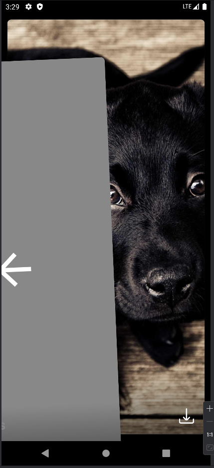

# Android-SwipeCardStack-View
a dynamic Android library tailored for creating an engaging card stack view, mimicking the iconic Tinder swipe functionality. Perfect for developers looking to add swipeable card views to their apps, this library offers customizable, smooth animations and gestures for swiping cards right, left, or up with ease. 

## How It Works

SwipeCardStackView leverages the power of the 'com.yuyakaido.android:card-stack-view:2.3.4' dependency to create a customizable and interactive card stack. Each card in the stack can be swiped away, revealing the next card underneath. This interaction not only feels natural and intuitive but also adds a layer of engagement and dynamism to your app's user interface.

### Features:
- **Customizable Card Views:** Design each card with your custom layout to display any content, from images to text or a combination of both.
- **Smooth Animations and Gestures:** Enjoy the seamless, responsive swipe gestures that users have come to expect from modern apps.
- **Directional Swiping:** Implement actions based on the direction of the swipe, such as liking, dismissing, or saving information.

### App Images



## Getting Started

To integrate SwipeCardStackView into your project, ensure you include the following dependency in your app's `build.gradle` file:

```gradle
dependencies {
    implementation 'com.yuyakaido.android:card-stack-view:2.3.4'
} ...


This dependency is crucial for enabling the card stack functionalities within your application. By incorporating SwipeCardStackView, you're not just enhancing your app's UI/UX; you're also creating an interactive experience that can keep your users engaged.

Remember, the key to a successful implementation is creativity in how you design your cards and the interactions that follow each swipe. Whether it's for a dating app, a job search platform, or a product browsing feature, SwipeCardStackView is flexible enough to fit your needs.

Dive into the documentation and sample codes to start implementing your swipeable card stack view today. Happy coding!

## Contributing

Feel free to contibute to this project , you can also add new features to make it more better , Thanks ...
